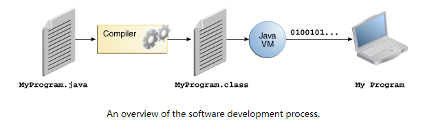

# Java技术介绍

* 关于Java技术
* Java可以用来做什么
* Java如何改变我们的生活

## 关于Java技术

Java技术由编程语言和平台组成。

### Java编程语言（JPL）

JPL是一种高级的编程语言，具有一下特点:

- Simple(简单)
- Object oriented(面向对象)
- Distributed(分布式)
- Multithreaded(多线程)
- Dynamic(动态的)
- Architecture neutral
- Portable(可移植)
- High performance(高性能)
- Robust(健壮的)
- Secure(安全的)

每一种特点在[The Java Language Environment](http://www.oracle.com/technetwork/java/langenv-140151.html)中都有解释。这份文档由James Gosling 和 Henry McGilton撰写。

在JPL中所有的源码都存储在以.java结尾的文本文件中。源代码文件可以通过`javac`命令编译成`.class`文件。`.class`文件中保存的是字节码，它是Java虚拟机（JVM）的机器语言。之后就可以使用`java`命令在启动一个JVM实例运行你的程序了。

因为JVM能运行在不同的操作系统上，所以`.class`文件可以在windows,linux,mac os...上运行。有些JVM为提高性能会在运行你的程序时执行一些额外的操作（JIT编译等），例如查找性能瓶颈并重新编译经常使用的代码。

### Java平台

平台是指程序运行的硬件或软件环境，上面已经提到了一些流行的平台，比如windows,linux,mac。多数的平台是操作系统和底层硬件的组合。Java平台则只是一个软件平台，并运行在其它的平台之上（Java的跨平台特性）。

Java平台有两个组件：

* JVM
* Java API

前面已经简单介绍了JVM，它是Java平台的基础，建立在其它硬件平台之上。

Java API是一套软件的集合，提供了很多有用的功能。被分组到相关的类和接口的库中。这些库被称为packages。后面将重点介绍API提供的一些功能。

Java平台比原生程序要慢一些，然而高级的编译器和虚拟机技术已经使性能接近原生程序并且不影响可移植性。

## Java可以用来做什么

JPL是一个强大的软件平台。基于Java平台实现的程序将被赋予下面的特性：
* 开发工具——Java开发工具包提供了编译、运行、监控、调试、生成文档等方面的工具。开发者通常使用`javac`编译，使用`java`启动，`javadoc`生成文档。
* API——API为JPL提供了非常核心的功能。提供了大量的类用于你的应用，从基本的对象到网络和安全，再到操作XML和数据库，总之应有尽有。要查看他包含了什么，可以访问[ Java Platform Standard Edition 8 Documentation.](https://docs.oracle.com/javase/8/docs/index.html)
* 部署技术
* UI技术——Java为创建复杂的GUI提供了JavaFX，Swing，Java2D等框架。
* 集成库——集成库例如IDL，JDBC，JNDI，RMI等技术。

## Java如何改变我们的生活（下面的结论是对比C++得出来的）

* 快速的入门，尽管JPL是一门强大的面向对象语言。但比起C或者C++，它学习起来非常简单。
* 写更少的代码
* 写更好的代码
* 开发更加快速
* 避免平台依赖
* 一次编写，到处执行
* 发布软件更加容易