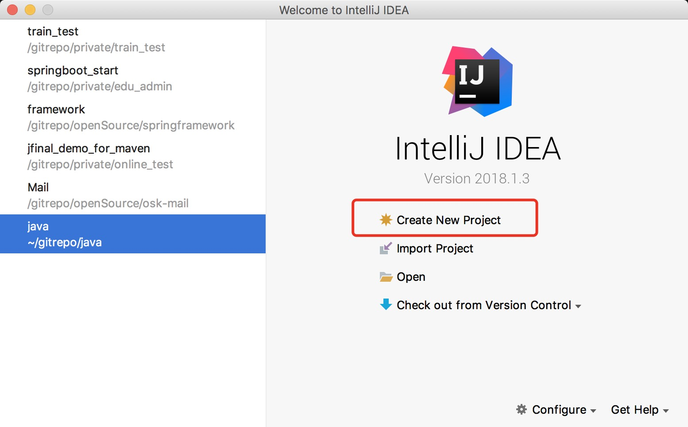
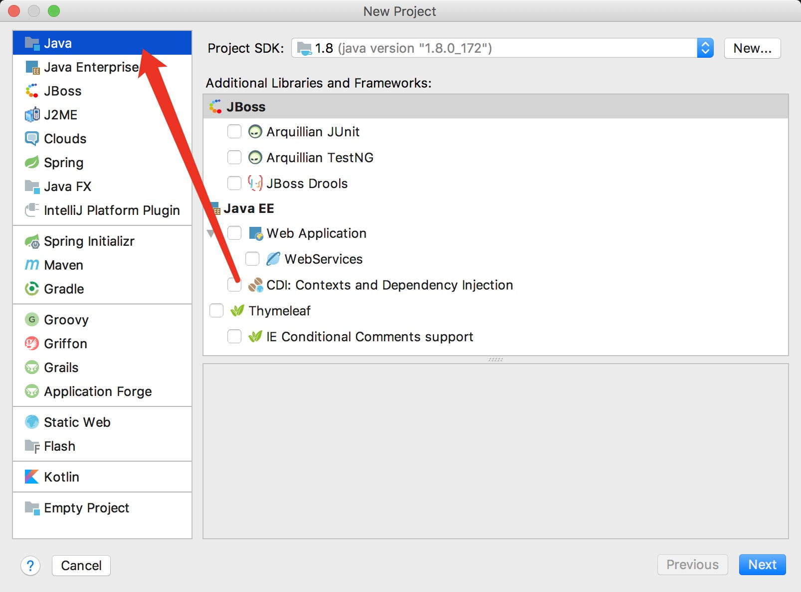
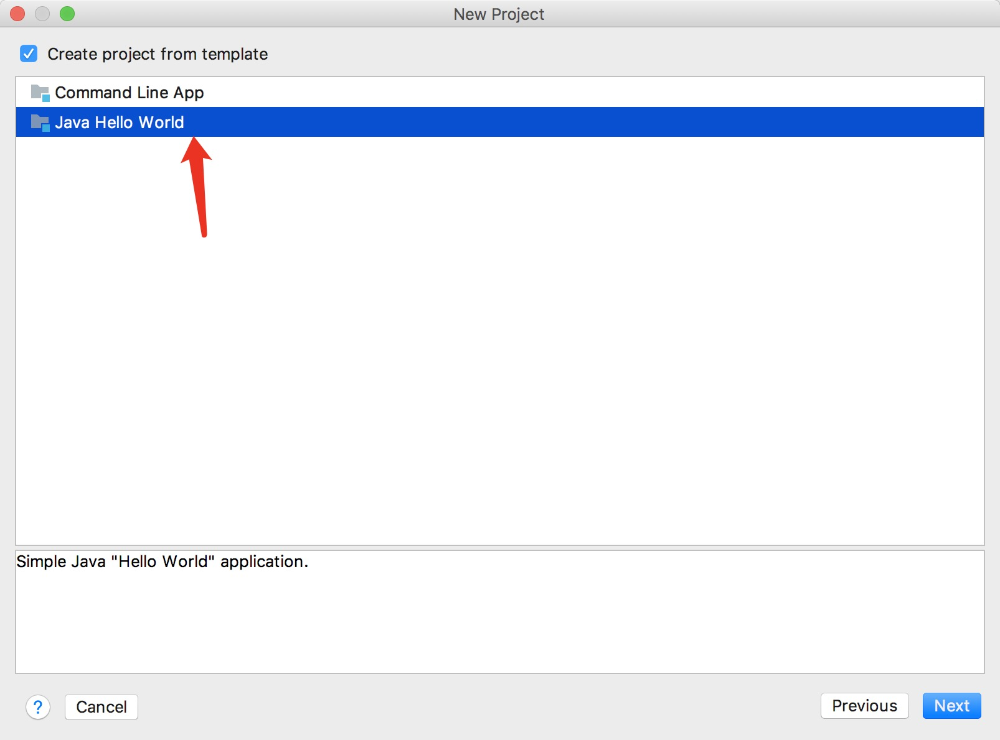
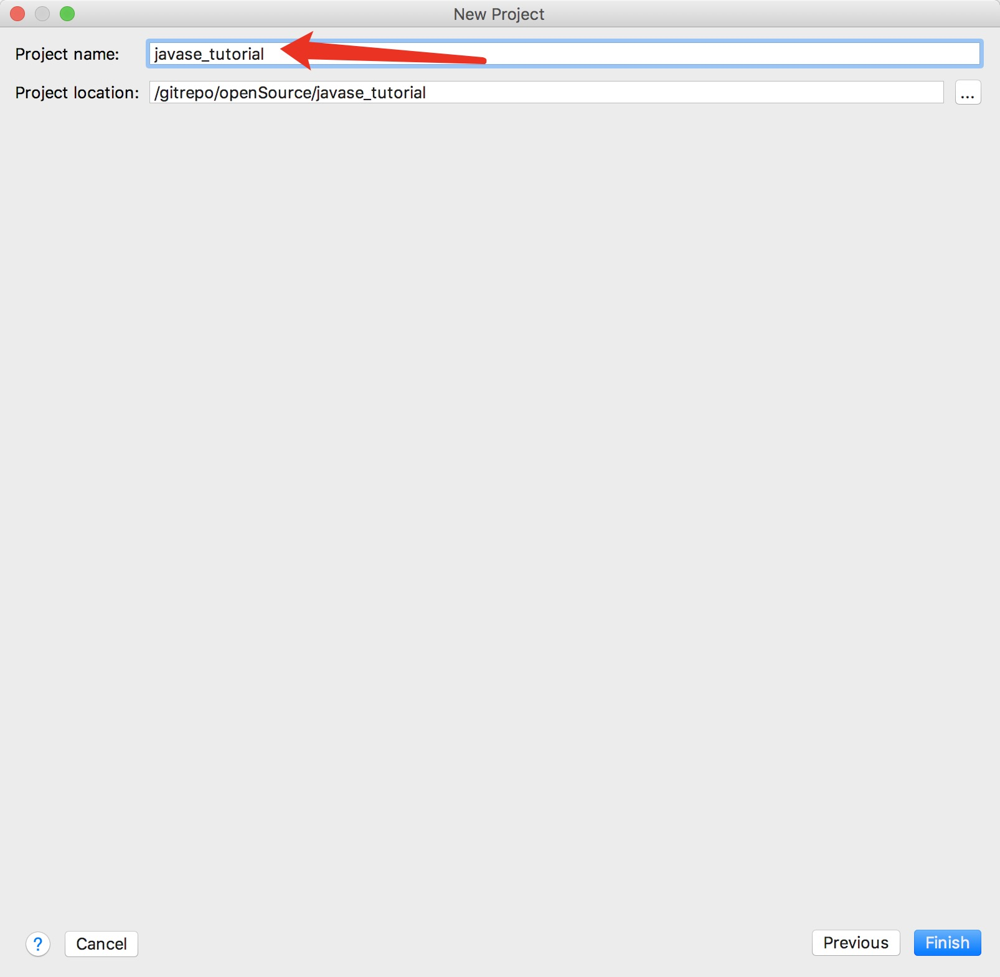
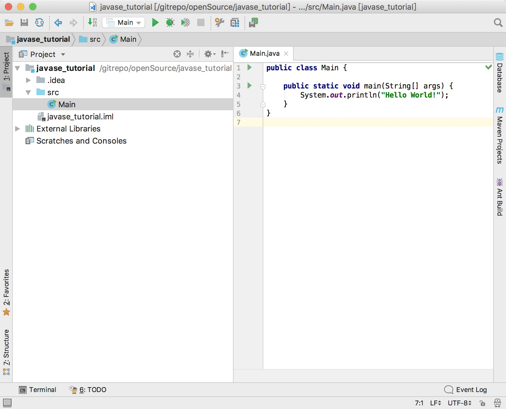
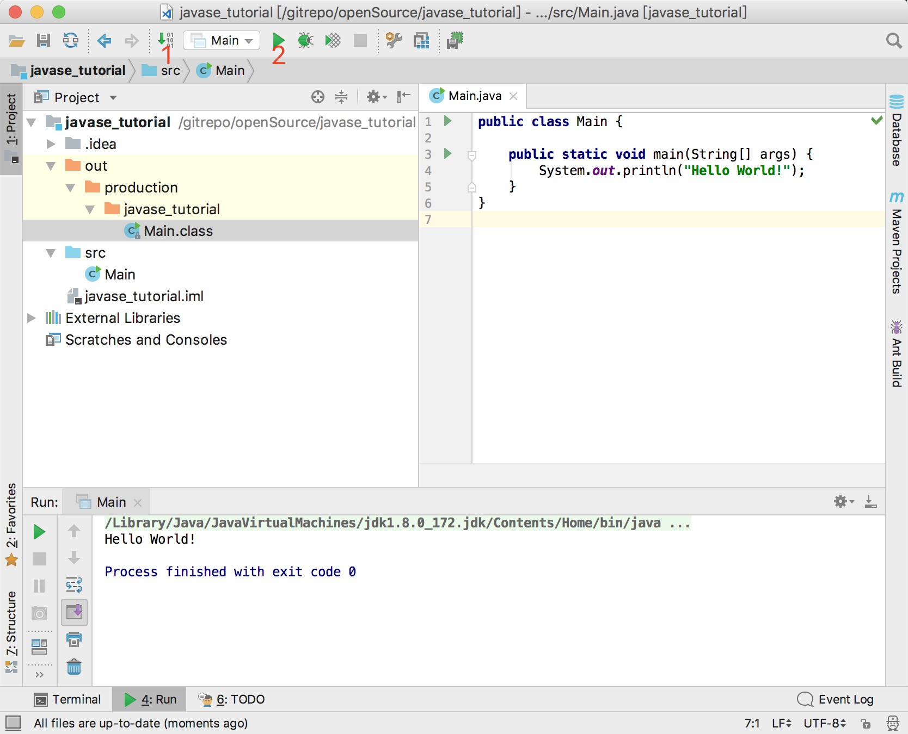

# The "Hello World!" Application

> 这一张主要介绍在linux环境下运行HW，windows平台上运行的方式类似。

* HW for linux and solaris os
* 在IDE中运行(官方提供的是NetBeans IDE，这里换成IDEA)
* HW for windows

## 基于Linux的HelloWorld

接下来编写你的第一个程序，这些说明是针对Linux或者Solaris OS的用户
如果遇到问题可以在常见问题中寻找答案。

### 开始清单

	1. JDK8
	下载地址：http://www.oracle.com/technetwork/java/javase/downloads/index.html
	安装介绍：https://docs.oracle.com/javase/8/docs/technotes/guides/install/install_overview.html
	2. 编辑器
	linux上可以使用`vi or emacs`,windows建议使用notepad++，vscode。。。

### 创建你的第一个应用

	第一个程序的效果将会简单的在屏幕上输出`hello world!`.

	* 创建一个源码文件
	* 将源码文件编译成class文件
		Java程序编译器`javac`可以将源文件编译成JVM能理解的指令。这些指令集将以bytecodes的方式包含在class文件中。
	* 运行程序
		使用`java`命令启动JVM运行你的程序。

#### 创建一个源码文件

打开一个新的terminal窗口。

```shell	
# 进入文件夹/tmp
full@14:15:35 tmp $ cd /tmp/
# 创建文件夹examples
full@14:15:42 tmp $ mkdir examples
full@14:15:47 tmp $ cd examples/
full@14:15:50 examples $ mkdir java
full@14:15:53 examples $ cd java
# 显示当前所在路径
full@14:15:54 java $ pwd
/tmp/examples/java
```	

现在你可以创建一个源码文件。

```shell
vi HelloWorldApp.java
```

```java
class HelloWorldApp {
    public static void main(String[] args) {
        System.out.println("Hello World!"); // Display the string.
    }
}
```

> 注意：上面执行的命令以及程序源码都是大小写敏感的，原因可能归咎于C语言就是一种大小写敏感的语言，然后linux继承了这一特性，Java本身也是大小写敏感的程序语言，例如：`HelloWorldApp` 和 `helloworldapp`是不同的.

#### 将源码文件编译成class文件

```shell
# 进入/tmp/examples/java/文件夹下
full@15:47:56 java $ cd /tmp/examples/java/
full@15:48:05 java $ pwd
/tmp/examples/java
# 列出当前目录下的文件和文件夹
full@15:48:07 java $ ls
HelloWorldApp.java
```

接下来开始编译`HelloWorldApp.java`，执行如下命令：

```
full@15:51:51 java $ javac HelloWorldApp.java
full@15:51:55 java $ ls
HelloWorldApp.class  HelloWorldApp.java
```

编译后将会生成`HelloWorldApp.class`文件。

#### 运行程序

现在可以运行程序了，在当前目录下执行下面命令：

```
full@15:51:58 java $ java HelloWorldApp
Hello World!
```

如果你同样输出了Hello World!，那么恭喜。
有任何问题可以在本章最后一节查找答案，或者在[github-issue](https://github.com/icngor/javase_tutorial_Zh/issues)下留言。

## 在IDE中运行

上一节在linux下编写并成功执行了HW程序。接下来在windows10的环境中使用IDEA编写一个java程序。Java官方提供了NetBeans IDE，鉴于国内Java开发使用eclipse和Idea较广泛，这里使用Idea举例。

* 清单
* 创建第一个程序
	* 安装JDK8
	* 创建一个IDE项目
	* 编译源程序
	* 运行程序
* 关于idea的教程

### 开始清单

1. 安装JDK8

	JDK的安装可以参照上一节的官网地址。

2. 安装IDEA

	https://www.jetbrains.com/idea/ ，访问这个地址下载安装包，官网提供了多种操作系统的安装包，并且有商业授权和社区授权之分，选择社区版下载，跟其它windows程序安装类似。

### 创建第一个程序

如下图，选择`Create New Project`


创建一个Java项目


选择模板`Java Hello World`，然后点击`next`


输入项目名称`javase_tutorial`(此项目已上传到github，教程中所有的代码示例都放在此项目中)，然后点击`finish`


Idea自动生成HelloWorld项目源码如图：


点击1所示按钮，相当于执行`javac`,编译生成了Main.class。
点击2所示按钮，会编译并且执行Main，在控制台输出了`Hello World!`。



### Idea教程

Idea官网提供了详细的教程：https://www.jetbrains.com/idea/documentation/
	


## Windows平台
windows平台类似，这里不再介绍。
	
	
	
	
	
	
	
	
	
	